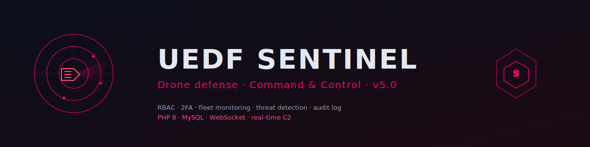
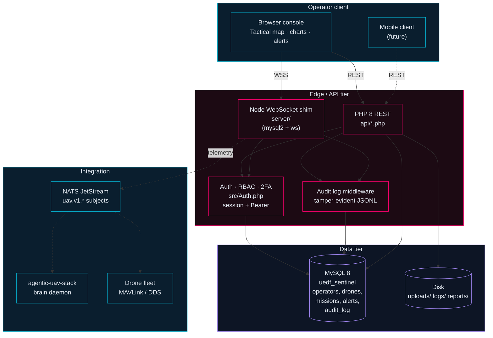

# UEDF Sentinel v5.0



[](https://github.com/CBahtaria/sentinel/actions/workflows/ci.yml)
[](https://www.php.net/)
[](https://www.mysql.com/)
[](./SECURITY-AUDIT-2026-05-21.md)
[](./SECURITY-AUDIT-2026-05-21.md)
[](#license)

Real-time command and control platform for the **Unified Eswatini Defence
Force**. Drone fleet supervision, threat detection, predictive analytics,
operator-grade RBAC with 2FA, and a tamper-evident audit log. PHP 8 +
MySQL on the data plane, Node.js WebSocket shim for telemetry, browser-based
operator console.

Sister project to [agentic-uav-stack](https://github.com/CBahtaria/agentic-uav-stack)
— the C2 layer for the autonomous platform. Both subscribe to the same
NATS namespace (`uav.v1.*`).

> **Security audit complete (2026-05-21) — awaiting UAT.** All 9 findings resolved (3 Critical + 6 High). System is cleared for user acceptance testing. See [`SECURITY.md`](./SECURITY.md) and [`SECURITY-AUDIT-2026-05-21.md`](./SECURITY-AUDIT-2026-05-21.md).

---

## Architecture



---

## Features

### Identity, access, audit

- **RBAC** — Commander, Operator, Analyst, Viewer (least-privilege defaults).
- **2FA** — TOTP per user; recovery codes; mandatory for Commander role.
- **Session policy** — IP whitelist per role; configurable session timeout.
- **Audit log** — every privileged action lands in `audit_log` and on disk
  (`logs/audit-YYYY-MM-DD.jsonl`). Tamper-evident by hash chaining.

### Drone fleet

- Fleet inventory + per-drone state (online/offline, battery, position,
  last-seen).
- Real-time tactical map (live position; geofence overlays).
- Telemetry monitoring + alarm thresholds.
- Drone recording library (video assets indexed in DB, files on disk).

### Threat management

- Real-time threat detection feed.
- Threat heatmap visualisation.
- Emergency alert system (operator-broadcast to all logged-in clients).
- Investigation workflow with notes, attachments, escalation chain.

### Analytics

- Predictive analytics (ML v2.1) — incident-rate forecasting per region.
- Real-time charts for fleet health and operations tempo.
- Report generation (PDF / CSV / JSON) — daily, weekly, monthly cadences.

### Administration

- User management UI for Commander role.
- System settings panel.
- Audit log viewer with filters.
- Backup / restore tooling (`scripts/backup.sh`, `scripts/restore.sh`).

---

## System requirements

| Component | Minimum | Recommended |
|---|---|---|
| Web server | Apache 2.4 / Nginx 1.18 | Nginx 1.24 + PHP-FPM |
| PHP | 8.1 | 8.3 |
| MySQL / MariaDB | MySQL 5.7 / MariaDB 10.2 | MySQL 8.0 / MariaDB 10.11 |
| Node.js (server shim) | 18 | 20 LTS |
| RAM | 2 GB | 8 GB |
| Storage | 5 GB | 50 GB (logs + recordings) |
| Browser | Chrome 90 / Firefox 88 / Edge 90 | Chrome 120 / Firefox 121 |

**Required PHP extensions:** `pdo`, `pdo_mysql`, `json`, `session`, `openssl`,
`gd`, `curl`, `mbstring`.

---

## Installation

### Automated installer

```bash
git clone https://github.com/CBahtaria/sentinel
cd sentinel
# Edit config/settings.php — DB credentials, base URL, debug flag
# Edit api/config.php — env-loaded secrets only (no literals)
# Visit http://your-server/sentinel/install.php and follow the wizard
```

Wizard steps:

1. System requirements check
2. Database configuration (creates `uedf_sentinel` database and tables)
3. Admin account setup
4. Initial seed (operators, default settings)
5. Installation complete + post-install security checklist

### Manual installation

```bash
# 1. Create the database
mysql -u root -p < database/schema.sql

# 2. Copy config templates and fill secrets
cp config/settings.php.example config/settings.php
cp api/config.php.example api/config.php
# Edit both — set DB creds, API base URL, mobile API key

# 3. Install Node shim dependencies
cd server && npm ci && cd ..

# 4. Start the WebSocket shim
cd server && node index.js &

# 5. Point your web server at the project root
# (Apache: <Directory> + DocumentRoot; Nginx: location / { try_files })
```

### Post-install security checklist

Before opening to non-VPN traffic, run through
[`SECURITY-AUDIT-2026-05-21.md`](./SECURITY-AUDIT-2026-05-21.md):

- [ ] Rotate the 4 default seeded users (`commander/operator/analyst/viewer`).
- [x] Move API key into `.env` — `SENTINEL_API_KEY` env var required.
- [x] Remove the `localhost` + empty-password PDO fallback — env vars required.
- [x] Replace `Access-Control-Allow-Origin: *` with an explicit allowlist.
- [x] Convert raw interpolated queries to PDO prepared statements (`cron/daily_report.php`).
- [x] Add `session_regenerate_id(true)` to `login()`.
- [x] `display_errors=0` in production.
- [x] Add CSP/STS/XCTO/XFO/HSTS headers to all `api/*.php` entry points.
- [x] Login lockout enforced before `password_verify` (5 attempts → 15 min lockout).

---

## Project layout

```
sentinel/
├── api/                   REST endpoints (PHP)
├── modules/               Page-specific PHP handlers
├── src/                   Class hierarchy (Auth, DB, etc.)
├── includes/              Shared functions, bootstrap
├── config/                Environment + runtime config
├── database/              Schema + migrations
├── cron/                  Scheduled jobs (daily report etc.)
├── server/                Node WebSocket shim (mysql2 + ws)
├── assets/                Icons, CSS, client JS
├── uploads/               User uploads (gitignored)
├── logs/                  Runtime + audit logs (gitignored)
├── scripts/               Backup/restore + ops utilities
├── tests/                 PHPUnit tests
└── .github/               CI, dependabot, banner asset
```

---

## Operational mode

UEDF Sentinel is **command-and-control software for an active defence force**.
Threat model assumes:

- Network-resident adversaries (nation-state and criminal).
- Insider risk (privileged user misuse).
- Supply-chain risk on every dependency.

Configuration defaults are conservative: 2FA mandatory for privileged roles,
IP whitelist on Commander sessions, all writes audit-logged, no third-party
trackers, no telemetry.

---

## Roadmap

- [x] Core RBAC + 2FA + audit
- [x] Drone fleet inventory + tactical map
- [x] Real-time threat feed + heatmap
- [x] Report generation (PDF / CSV / JSON)
- [x] WebSocket telemetry shim
- [x] **Resolve all 9 audit findings** (completed 2026-05-21)
- [ ] CSP / security headers middleware
- [ ] Composer.json + PHPUnit harness
- [ ] Mobile client integration
- [ ] SIEM integration (OpenSearch / Splunk forwarder)

---

## Contributing

This is mission software for a real defence force. External contributions
are not accepted by default. Internal contributors: see the audit document
for the immediate work queue, and use feature branches off `develop`. Code
review is mandatory; nothing goes direct to `main`.

Security issues — see [SECURITY.md](./SECURITY.md). Do not open public
issues for vulnerabilities.

---

## License

Proprietary — Unified Eswatini Defence Force. All rights reserved.

---

## Related

- [agentic-uav-stack](https://github.com/CBahtaria/agentic-uav-stack) — the
  autonomous platform Sentinel commands.
- [CBahtaria](https://github.com/CBahtaria) — solo-engineer portfolio.
